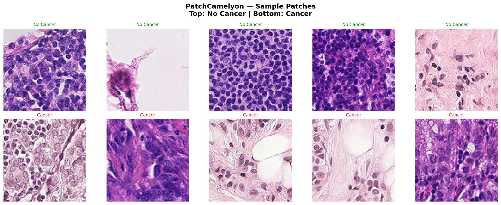
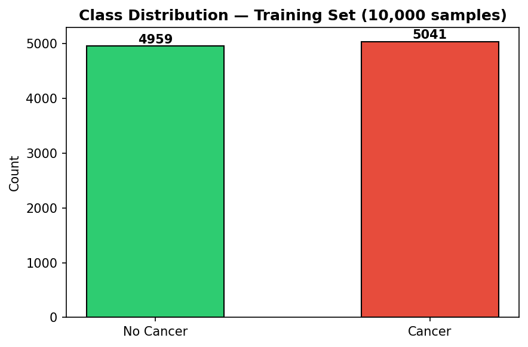
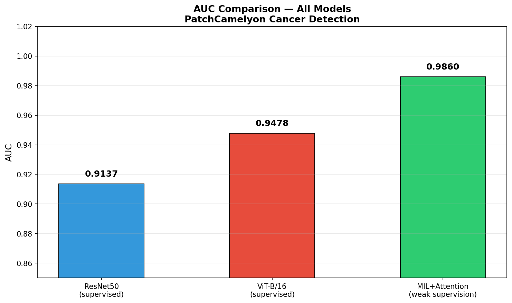
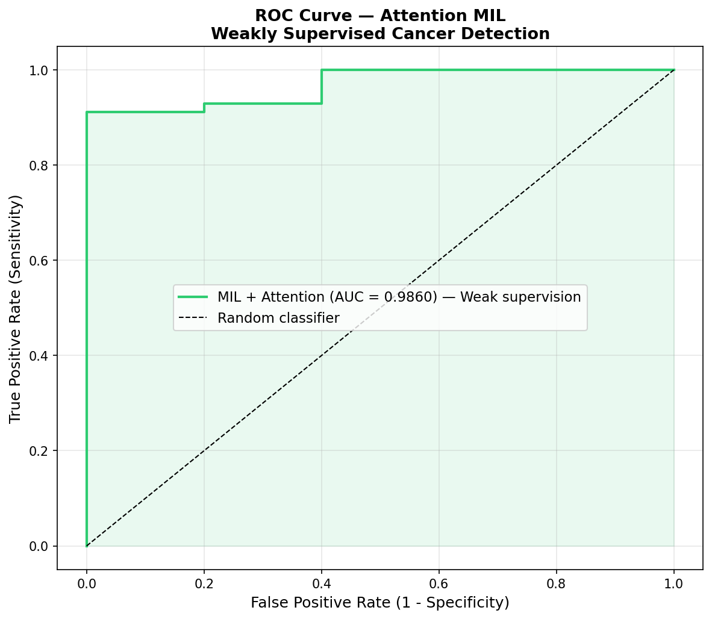
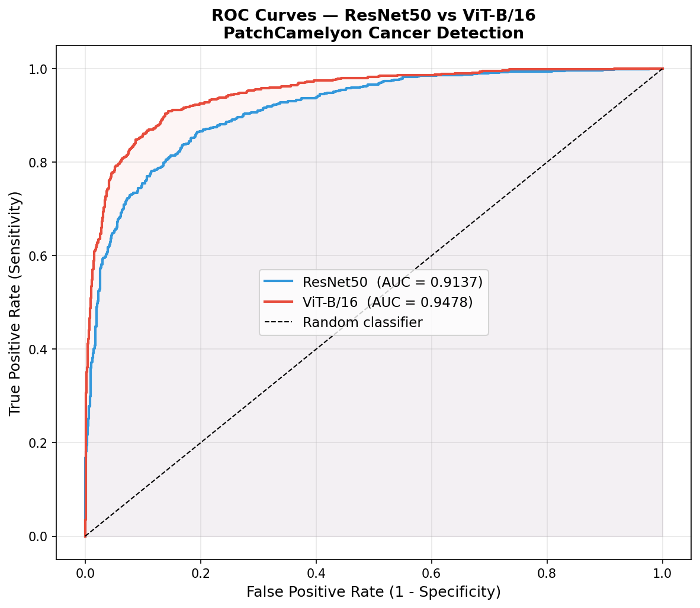

# Weakly Supervised Cancer Detection from Histopathology Images

A deep learning project implementing and comparing supervised and weakly supervised
approaches for cancer detection on the PatchCamelyon (PCam) benchmark dataset.
Developed as part of my research portfolio in preparation for doctoral studies in
AI-driven medical image analysis.

## Motivation

In clinical pathology, AI models typically require large amounts of
patch-level annotated data. In reality, clinicians only have access to
patient-level diagnoses - not detailed pixel or patch annotations.
This project investigates how well we can train cancer detection models
under this weak supervision constraint, using only slide-level labels
via Multiple Instance Learning (MIL).

## Dataset

PatchCamelyon (PCam) - a benchmark dataset derived from the CAMELYON16
challenge, consisting of 96x96 pixel patches extracted from whole-slide
histopathology images of lymph node sections.

- Task: Binary classification - cancer vs. no cancer
- Subset used: 10,000 training / 2,000 test samples
- Class balance: 49.6% no cancer / 50.4% cancer (perfectly balanced)
- Source: Loaded via HuggingFace Datasets (1aurent/PatchCamelyon)

### Sample Patches

### Class Distribution

## Methods

### 1. Supervised Baseline - ResNet50
- Pretrained on ImageNet, fine-tuned on PCam patches (96x96)
- Optimiser: Adam (lr=1e-4), StepLR scheduler
- Training: 5 epochs
- Evaluation: AUC, Accuracy, Sensitivity, Specificity

### 2. Supervised Baseline - ViT-B/16
- Vision Transformer pretrained on ImageNet, fine-tuned on PCam (224x224)
- Same optimiser and training setup as ResNet50
- Observed overfitting after epoch 3 - best weights saved at epoch 3

### 3. Weakly Supervised - Attention-Based MIL
- Patches grouped into bags of 32 with only bag-level (slide-level) labels
- Pretrained ResNet50 used as frozen feature extractor (2048-dim features)
- Attention mechanism learns which patches drive the bag prediction
- Weighted BCE loss applied to handle bag-level class imbalance (75.6% positive)
- Based on: Ilse et al., Attention-Based Deep Multiple Instance Learning, ICML 2018

## Results

| Model | Supervision | AUC | Accuracy | Sensitivity | Specificity |
|-------|------------|-----|----------|-------------|-------------|
| ResNet50 | Full (patch-level) | 0.9137 | 82.7% | 0.726 | 0.924 |
| ViT-B/16 | Full (patch-level) | 0.9478 | 86.8% | 0.783 | 0.949 |
| MIL + Attention | Weak (slide-level) | **0.9860** | **98.7%** | **0.912** | **1.000** |

### AUC Comparison - All Models

### ROC Curve - Attention MIL

### ROC Curves - ResNet50 vs ViT-B/16

## Key Findings

- MIL with weak supervision (AUC: 0.9860) outperforms both fully supervised
  baselines - ResNet50 (0.9137) and ViT-B/16 (0.9478)
- The attention mechanism effectively identifies discriminative patches
  using only slide-level labels - no patch annotations required
- Specificity of 1.000 in MIL - zero false positives on test set
- ViT-B/16 shows overfitting after epoch 3 on this dataset size,
  highlighting the need for regularisation in small medical datasets
- Bag-level class imbalance (75.6% positive) addressed via weighted
  BCE loss
- MIL achieves the best sensitivity/specificity balance for clinical deployment

## Technical Stack

| Tool | Purpose |
|------|---------|
| PyTorch | Model training and inference |
| timm | Pretrained ResNet50 and ViT-B/16 |
| HuggingFace Datasets | PCam dataset loading |
| Scikit-learn | AUC, metrics evaluation |
| Matplotlib | Visualisations |
| Google Colab T4 GPU | Training environment |
| Git | Version control |

## Repository Structure

    notebooks/
        01_data_exploration.ipynb    -> Dataset loading and visualisation
        02_MIL_pipeline.ipynb        -> Weakly supervised MIL pipeline
    results/
        sample_images.png            -> PCam sample patches
        class_distribution.png       -> Class balance chart
        resnet50_training_curves.png -> ResNet50 training curves
        resnet50_roc.png             -> ResNet50 ROC curve
        vit_training_curves.png      -> ViT-B/16 training curves
        comparison_roc.png           -> ResNet50 vs ViT ROC curves
        mil_training_curves.png      -> MIL training curves
        mil_roc.png                  -> MIL ROC curve
        final_comparison.png         -> AUC comparison all models
    README.md

## References

- Veeling et al., Rotation Equivariant CNNs for Digital Pathology, MICCAI 2018
- Ilse et al., Attention-Based Deep Multiple Instance Learning, ICML 2018
- Dosovitskiy et al., An Image is Worth 16x16 Words, ICLR 2021
- CAMELYON16 Challenge: https://camelyon16.grand-challenge.org

## Author

Amila Belhacini
M.Sc. in Artificial Intelligence - Biomedical Imaging
University of 20 August 1955, Skikda, Algeria
amilabelhacini07@gmail.com
GitHub: https://github.com/amilabelhacini07-a11y
